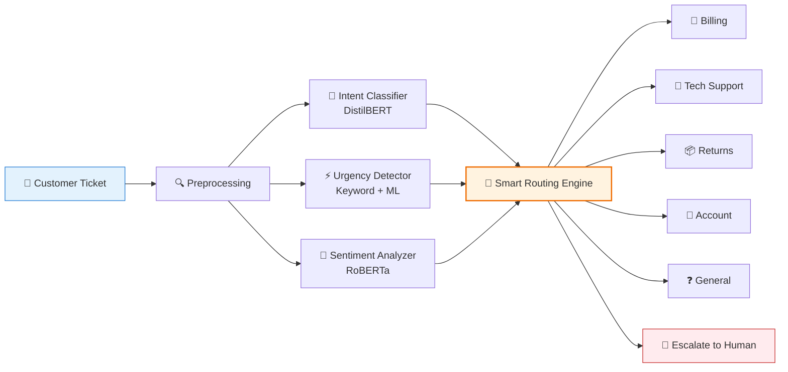
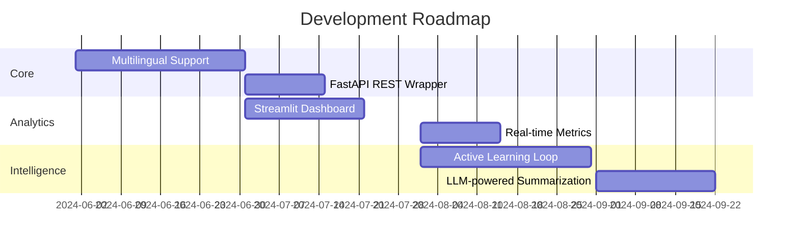

<div align="center">
    
# 🎫 AI Customer Support Ticket Classifier & Router


[🚀 Live Demo](https://huggingface.co/spaces/mohdali1/ticket-router-demo) • [📦 Model Card](https://huggingface.co/mohdali1/customer-support-ticket-classifier) • [💻 Source Code](https://github.com/mohdali-dev/customer-support-ticket-classifier)

</div>

---

## ✨ Overview

> 🤖 **Automate your support workflow** — Read, classify, prioritize, and route customer tickets in **under 1 second** with state-of-the-art NLP.



---

## 🎯 The Problem We Solve

| ❌ Before | ✅ After |
|-----------|----------|
| 🕐 Manual triage takes **hours** | ⚡ Auto-routing in **<1 second** |
| 🔄 Tickets misrouted between teams | 🎯 99% accurate department classification |
| 😤 Frustrated customers wait too long | 🚨 Critical issues flagged & escalated instantly |
| 📊 No visibility into ticket sentiment | 📈 Real-time urgency + sentiment analytics |
| 👥 Agents waste time on admin work | 🤖 AI handles routing, humans handle solving |

---

## 🏆 Key Results

<div align="center">

| Metric | Value | Visual |
|--------|-------|--------|
| **Overall Accuracy** | `99.0%` | ████████████████████ |
| **Billing F1-Score** | `0.99` | ████████████████████ |
| **Tech Support F1** | `0.99` | ████████████████████ |
| **Returns F1** | `0.93` | ██████████████████ |
| **Training Time** | `57s` (T4 GPU) | ⚡ |
| **Inference Latency** | `<1s` | 🚀 |
| **Training Samples** | `3,900` | 📚 |

</div>

---

## 🧠 How It Works: 3-Layer Intelligence

### 🔹 Layer 1: Department Classification
*Powered by fine-tuned DistilBERT*

```python
🎯 Predicts 1 of 5 departments:
├─ 💰 Billing       → payments, charges, invoices
├─ 🔧 Tech Support  → bugs, login, device issues  
├─ 📦 Returns       → refunds, cancellations, replacements
├─ 👤 Account       → profile, username, rewards
└─ ❓ General       → greetings, FAQs, small talk
```

### 🔹 Layer 2: Urgency Detection
*Hybrid keyword + ML scoring*

| Level | Triggers | Response |
|-------|----------|----------|
| 🔴 **Critical** | `fraud`, `unauthorized`, `emergency`, `asap` | 🚨 Immediate escalation |
| 🟠 **High** | `broken`, `error`, `not working`, `payment failed` | ⚡ Priority queue |
| 🟡 **Medium** | `complaint`, `issue`, `problem`, `help` | 📋 Standard queue |
| 🟢 **Low** | `question`, `how to`, `curious`, `info` | 🗂️ Batch processing |

### 🔹 Layer 3: Sentiment Analysis
*Powered by CardiffNLP RoBERTa*

```
😊 Satisfied  → "Thanks, this worked perfectly!"
😐 Neutral    → "How do I reset my password?"
😕 Unhappy    → "This is taking too long"
😠 Frustrated → "I've been waiting 3 days!! Fix this NOW!"
```

---

## 🧭 Smart Routing Logic

```python
def route_ticket(dept, urgency, sentiment, confidence):
    # 🚨 Safety first: low confidence or critical urgency → human
    if confidence < 0.60 or urgency == "critical":
        return "ESCALATE_TO_HUMAN"
    
    # ⚡ Priority handling: frustrated + high urgency
    if sentiment == "frustrated" and urgency in ["high", "critical"]:
        return f"PRIORITY_QUEUE_{dept.upper()}"
    
    # ✅ Standard routing
    return f"ROUTE_TO_{dept.upper()}"
```

### 📋 Example Predictions

| Customer Message | Dept | Urgency | Sentiment | Action |
|-----------------|------|---------|-----------|--------|
| `"my bill is wrong and I was overcharged"` | 💰 Billing | 🟠 High | 😕 Unhappy | `ROUTE_TO_BILLING` |
| `"someone made unauthorized transactions asap"` | 🔧 Tech | 🔴 Critical | 😠 Frustrated | 🚨 `ESCALATE_TO_HUMAN` |
| `"how do i update my username please"` | 👤 Account | 🟢 Low | 😐 Neutral | `ROUTE_TO_ACCOUNT` |
| `"I want to return my order and get a refund"` | 📦 Returns | 🟡 Medium | 😐 Neutral | `ROUTE_TO_RETURNS` |
| `"my password reset is not working urgently"` | 🔧 Tech | 🔴 Critical | 😠 Frustrated | 🚨 `ESCALATE_TO_HUMAN` |

---

## 🛠️ Tech Stack

| Component | Technology | Why? |
|-----------|-----------|------|
| 🤖 Intent Model | `distilbert-base-uncased` | Fast, lightweight, 99% accuracy |
| 💭 Sentiment Model | `cardiffnlp/twitter-roberta-base-sentiment` | State-of-the-art emotion detection |
| 📚 Dataset | [CLINC150](https://huggingface.co/datasets/clinc/clinc_oos) | High-quality, diverse support intents |
| 🎓 Training | HuggingFace `Trainer` API | Reproducible, scalable, distributed-ready |
| 🌐 Demo UI | [Gradio](https://gradio.app) | Beautiful, interactive, zero-config deploy |
| ☁️ Hosting | [HuggingFace Spaces](https://huggingface.co/spaces) | Free GPU, global CDN, auto-SSL |
| 🐍 Language | Python 3.10 | Clean syntax, rich ML ecosystem |

---

## 🚀 Quick Start

### ▶️ Try the Live Demo (No Install!)
[🔗 huggingface.co/spaces/mohdali1/ticket-router-demo](https://huggingface.co/spaces/mohdali1/ticket-router-demo)

### 💻 Run Locally in 3 Steps

```bash
# 1️⃣ Clone the repository
git clone https://github.com/mohdali-dev/customer-support-ticket-classifier.git
cd customer-support-ticket-classifier

# 2️⃣ Install dependencies
pip install -r requirements.txt

# 3️⃣ Launch the app
python app.py
```

✨ Then open: `http://localhost:7860`

---

## 🔁 Retrain & Customize

### 📓 Google Colab Training Notebook
[🔗 Open in Colab](https://colab.research.google.com/github/mohdali-dev/customer-support-ticket-classifier/blob/main/ticket_classifier.ipynb)

### 🔧 Fine-tune in 5 Lines

```python
from datasets import load_dataset
from transformers import DistilBertForSequenceClassification, Trainer

# Load data
dataset = load_dataset("clinc/clinc_oos", "plus")

# Load model
model = DistilBertForSequenceClassification.from_pretrained(
    "distilbert-base-uncased", num_labels=5
)

# Train & push
trainer = Trainer(model=model, train_dataset=dataset["train"])
trainer.train()
model.push_to_hub("your-username/customer-support-ticket-classifier")
```

### 📦 Use the Pre-trained Model

```python
from transformers import pipeline

classifier = pipeline(
    "text-classification",
    model="mohdali1/customer-support-ticket-classifier",
    return_all_scores=True
)

result = classifier("my bill is wrong and I was overcharged")
print(result)
# [{'label': 'billing', 'score': 0.998}, ...]
```

🔗 **Model Hub**: [huggingface.co/mohdali1/customer-support-ticket-classifier](https://huggingface.co/mohdali1/customer-support-ticket-classifier)

---

## 🗂️ Project Structure

```
customer-support-ticket-classifier/
├── 📄 app.py                      # Gradio web interface
├── 📄 requirements.txt            # Python dependencies  
├── 📓 ticket_classifier.ipynb     # End-to-end training notebook
├── 📄 README.md                   # You are here ✨
├── 📁 .github/
│   └── workflows/                 # CI/CD (future)
└── 📁 assets/
    ├── 🖼️ architecture.png        # System diagram
    └── 📊 results.png             # Performance metrics
```

---

## 🌟 Future Roadmap



### 🔜 Coming Soon
- 🌍 **Multilingual Support**: Urdu, Arabic, Hindi via `xlm-roberta`
- 🔌 **REST API**: FastAPI wrapper with OpenAPI docs & auth
- 📊 **Analytics Dashboard**: Real-time ticket volume, sentiment trends, SLA tracking
- 🔄 **Active Learning**: Let agents correct misroutes → auto-retrain model
- 🧩 **Extended Departments**: Shipping, Sales, Complaints, Enterprise

---

## 🤝 Contributing

We welcome contributions! Here's how to help:

1. 🍴 Fork the repository
2. 🌿 Create your feature branch: `git checkout -b feature/AmazingFeature`
3. 💾 Commit your changes: `git commit -m 'Add some AmazingFeature'`
4. 📤 Push to the branch: `git push origin feature/AmazingFeature`
5. 🔓 Open a Pull Request

📋 **Good first issues**: [View open issues](https://github.com/mohdali-dev/customer-support-ticket-classifier/issues)

---

## 📄 License

Distributed under the **MIT License**. See [`LICENSE`](LICENSE) for more information.

✅ Free for commercial use  
✅ Modify & distribute  
✅ No warranty provided  

---

## 👨‍💻 About the Author

<div align="center">

### Mohammad Ali
*Independent Researcher • Full-Stack ML Engineer • Low-Resource NLP Advocate*

[](https://huggingface.co/mohdali1)
[](https://github.com/mohdali-dev)
[](http://www.linkedin.com/in/mohdali1)
[](https://www.mohdali.me/)

</div>


<div align="center">

> 🚀 *Built with ❤️ for developers, support teams, and the open-source community*

</div>
